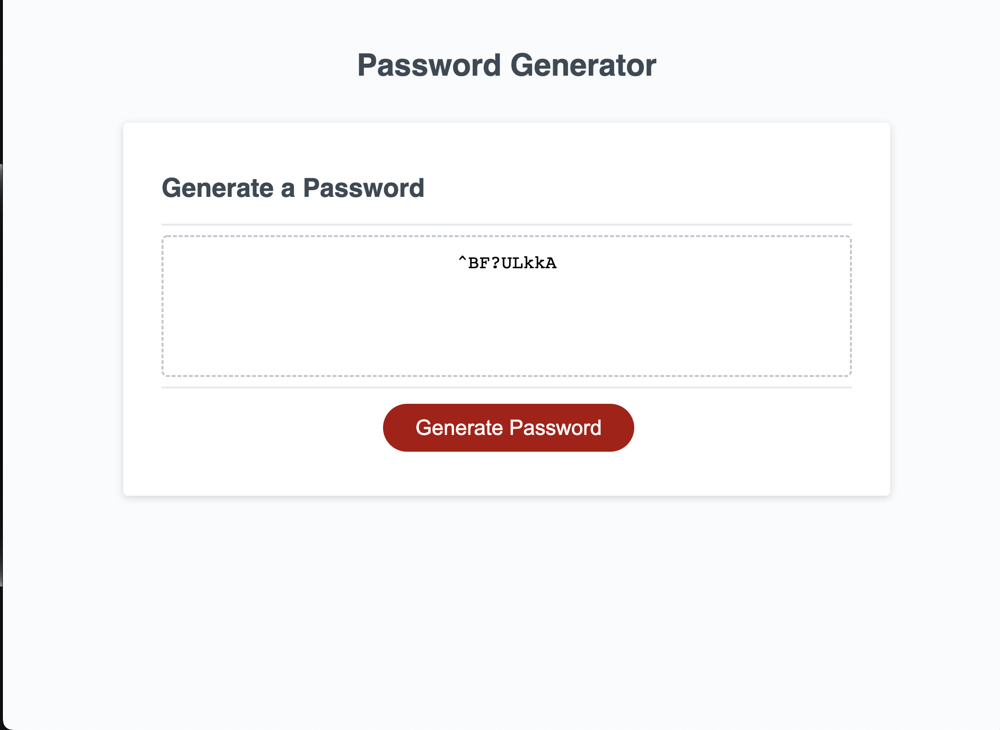

# Password_Challenge

# Description
This is an app that gives the user a new, secure password. When user clicks "Generate Password" button a rendomly generated password appears in the password window for the user to use. 

# Features
The app has several options to chose from:
1. Character length between 8 - 128;
2. The password can include lowercase, uppercase, numeric and special characters.
3. Password is generated based on user selected critetia.

# Usage

User can find a deployed app by clicking => [Password Challenge](https://rroip.github.io/Password_Challenge/)

[Git repo](https://github.com/rroip/Password_Challenge)